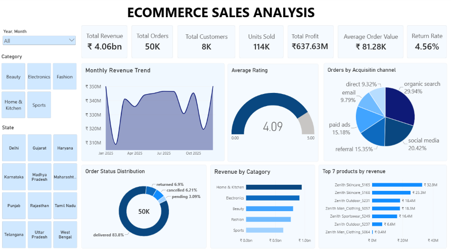

# E-commerce Sales Analysis

An end-to-end e-commerce sales analysis project using **Python, SQL, and Power BI** to clean, analyze, and visualize sales data and generate actionable business insights.

## 📊 Dashboard 



The Power BI dashboard provides an overview of:

- Total Revenue
- Total Orders
- Total Customers
- Units Sold
- Total Profit
- Average Order Value
- Return Rate
- Monthly Revenue Trend
- Average Customer Rating
- Orders by Acquisition Channel
- Order Status Distribution
- Revenue by Category
- Top Products by Revenue

## 🛠️ Tools & Technologies

- **Python** – Data cleaning and preprocessing
- **SQL** – Data analysis and business queries
- **Power BI** – Data visualization and dashboard development
- **Excel/CSV** – Data storage and initial data handling

## 🔄 Project Workflow

1. Collected and examined raw e-commerce datasets
2. Cleaned and standardized the data using Python
3. Removed duplicates and handled missing/inconsistent values
4. Performed business analysis using SQL
5. Built an interactive Power BI dashboard
6. Derived insights related to revenue, orders, customers, products, categories and returns

## 📁 Dataset

The project contains six datasets:

- Customers
- Orders
- Order Items
- Products
- Payments
- Returns

The repository contains both **raw** and **cleaned** datasets.

## 📂 Repository Structure

```text
Ecommerce-Sales-Analysis/
│
├── Data/
│   ├── Raw/
│   └── Cleaned/
│
├── Ecommerce_Data_Cleaning.ipynb
├── Ecommerce_Sales_Analysis.pbix
├── Ecommerce_sql_analysis.sql
└── README.md
